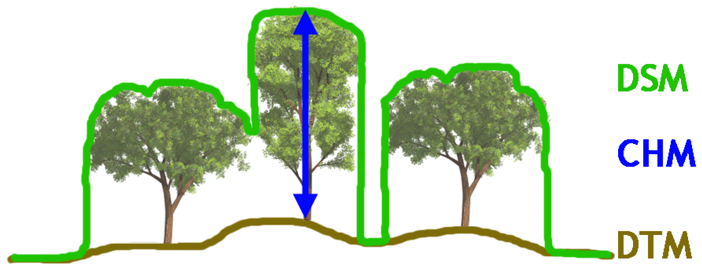
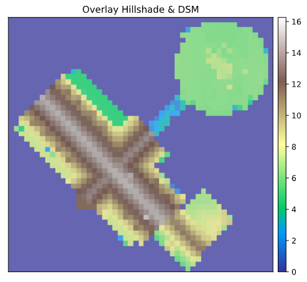
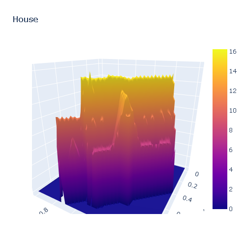

### 3D Houses3

### Publication date: 25 Feb 2021

### Objective:

To obtain a 3d plot of a house in in Flanders.

### About the Proyect:

This project uses images obtained from Geopunt.be that were prepared with the lidar method. Lidar is a method used to produce maps, in this case, these images have been used to obtain information about the height of buildings. Once the heights of a geographical area are obtained, they are plotted in 3D.

The code can be found in **3DHouses.py**

### What do we need to plot in 3D

First we need to transform an address into geographic coordinates, then find what is the shape of the property and then find only the height data for the property area.

The height of a property can be obtained by calculating the Canopy Height Model. This model is the difference between the surface map (DSM) that includes buildings, trees, etc, and the map (DMT) that only includes the bare ground without any objets.

Once the model is calculated and the data is obtained, we can plot the surface of the property.

In order to do the above, we need python packages that request information directly from a database (API), packages that manipulate geographic information in the form of images and matrices, and also packages for plotting.

### Procces:

1. Obtain (via API) the geographic coordinates and dimensions of the property.
2. Select the map to analyze.
3. Download and extract the DTM map
4. Download and extract the DSM map
5. Unzip the files
6. Calculate the Canopy Height Model ( DSM map - DTM map)
7. Make an intersection between the canopy model and the property boundaries
8. PLot the elevation data as a surface.

### Example

 

### Pending things to do:

- Find a way to access maps without having to download them.

- Plot other information about the houses, such as diameter, area or other characteristics.

- Reshape the Code with an OOP approach

#### Other files:

- The Files **Essay_with_WMS\*** is a work in progress that attempts to obtain the maps without having to download them.
- Ressources folfer. Contains files during the exploration phase and others like:
  - **CSV_production** is the code used to prepared dsm_info.csv and dtm_info.csv. These two csv files show the maps of the region and its geographic boundaries.
